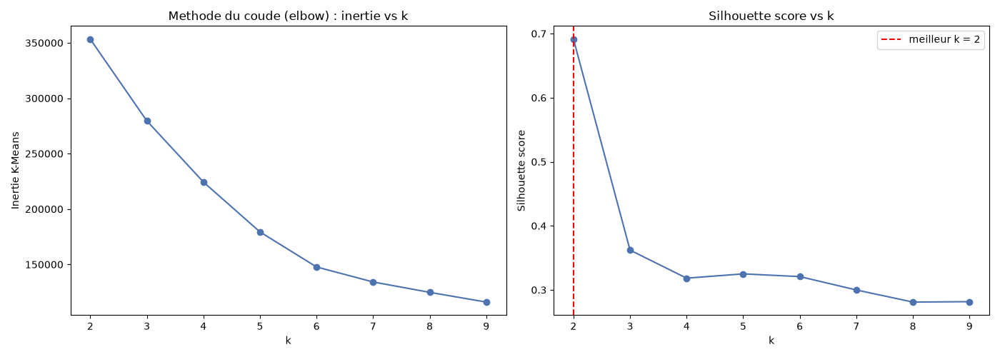
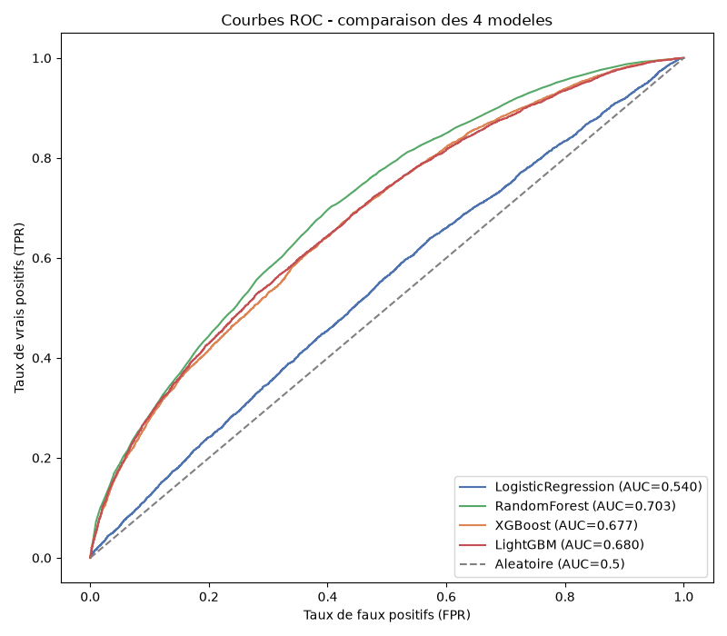
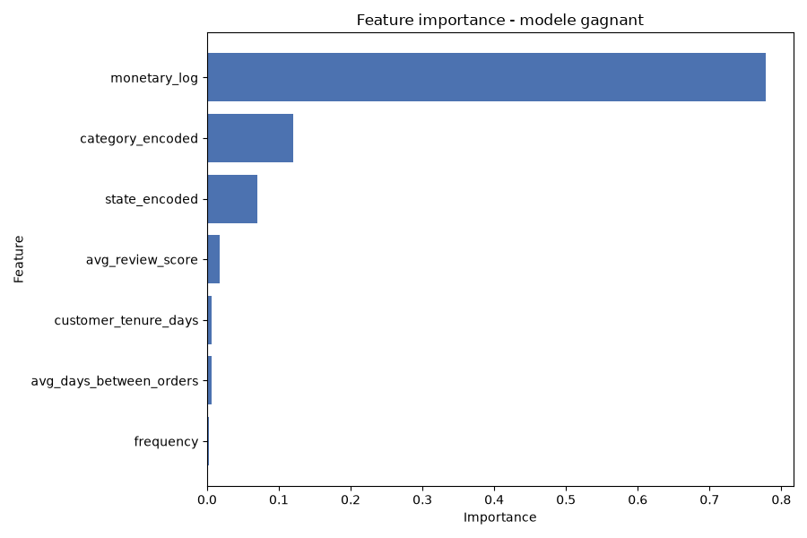

# Customer Intelligence Platform — Segmentation & Prédiction du Churn

Projet data de bout en bout sur les données e-commerce **Olist** (Brésil) : de 8 fichiers CSV bruts jusqu'à une segmentation clients exploitable par le marketing et un modèle de prédiction du churn.


---

## Problème métier

Une plateforme e-commerce veut savoir **quels clients elle est en train de perdre** et **comment adapter ses actions marketing à chaque type de client**.

Les données le montrent clairement :
- **97 %** des clients n'ont passé qu'**une seule commande** ;
- **58,9 %** des clients sont considérés comme perdus (aucun achat depuis plus de 180 jours).

Le projet répond à deux questions :
1. **Qui sont nos clients ?** → segmentation en groupes aux comportements distincts.
2. **Qui risque de partir ?** → modèle de prédiction du churn.

## Architecture du pipeline

```
 8 CSV bruts Olist
        │
        ▼
 ┌──────────────┐   ┌──────────────┐   ┌──────────────┐
 │  Ingestion   │──▶│  Nettoyage   │──▶│     EDA      │
 │ merge idem-  │   │ agrégation   │   │  KPI métier  │
 │ potent       │   │ par client   │   │              │
 │ 119K lignes  │   │ 93K clients  │   │              │
 └──────────────┘   └──────────────┘   └──────────────┘
                                              │
                                              ▼
                    ┌──────────────┐   ┌──────────────┐
                    │ Segmentation │◀──│   Features   │
                    │   K-Means    │   │ RFM, encoda- │
                    │  4 segments  │   │ ge, scaling  │
                    └──────────────┘   └──────────────┘
                                              │
                                              ▼
                                       ┌──────────────┐
                                       │  Prédiction  │
                                       │   du churn   │
                                       │  4 modèles   │
                                       └──────────────┘
```

Chaque étape est un module Python indépendant et **idempotent** : on peut le relancer sans dupliquer ni corrompre les données.

## Dataset

[Brazilian E-Commerce Public Dataset by Olist](https://www.kaggle.com/datasets/olistbr/brazilian-ecommerce) (Kaggle) : environ 100K commandes passées entre 2016 et 2018, réparties sur **8 tables** (clients, commandes, articles, paiements, avis, produits, vendeurs, traduction des catégories).

Le merge des 8 tables donne **119 143 lignes × 37 colonnes**, agrégées ensuite en **93 358 clients uniques**.

## Résultats

### Segmentation (K-Means, k = 4)

| Segment | Part des clients | Profil | Action recommandée |
|---|---|---|---|
| **Champions** | 3,0 % | Plusieurs commandes, dépense la plus élevée | Programme de fidélité, cross-sell |
| **Fidèles** | 45,9 % | Achat récent, très satisfaits, une seule commande | Relance pour déclencher un 2ᵉ achat |
| **À risque** | 16,3 % | Satisfaction très basse (note moyenne 1,7/5) | Contact service client, geste commercial |
| **Perdus** | 34,7 % | Dernier achat il y a plus d'un an | Campagne de réactivation à faible coût |

**Pourquoi k = 4 et pas k = 2 ?** Le score de silhouette était meilleur pour k = 2 (0,69), mais deux groupes ne permettent pas de distinguer les clients à fort potentiel des clients à risque. J'ai choisi k = 4 pour obtenir des segments **actionnables** par le marketing. K-Means a aussi été comparé à DBSCAN et au clustering hiérarchique.



### Prédiction du churn

4 modèles comparés : Régression logistique, Random Forest, XGBoost, LightGBM. Le déséquilibre des classes est géré avec `scale_pos_weight`, sur un split train/test 80/20 stratifié.

**Résultat : ROC-AUC entre ~0,54 et ~0,70 selon le modèle.**



#### ⚠️ Une fuite de données détectée et corrigée

Au premier entraînement, les 4 modèles obtenaient un **ROC-AUC de 1,0**. Un score parfait est suspect : en analysant les features, j'ai constaté que `recency_days` définissait directement la cible (churn = `recency_days` > 180 jours). Le modèle ne prédisait rien, il retrouvait simplement une règle de seuil.

J'ai donc **exclu `recency_days`** et gardé 7 features purement comportementales : fréquence, montant dépensé (log), note moyenne, ancienneté, délai moyen entre commandes, État et catégorie.

Le score est plus bas, mais **honnête** : il reflète un vrai signal, faible, sur un dataset où 97 % des clients n'achètent qu'une fois.



## Installation

```bash
git clone https://github.com/Amenmalleh/Customer-Intelligence-Platform-End-to-End-Data-AI-Engineering-Project.git
cd Customer-Intelligence-Platform-End-to-End-Data-AI-Engineering-Project

python -m venv venv
source venv/bin/activate        # Windows : venv\Scripts\activate
pip install -r requirements.txt
```

Télécharge ensuite le dataset depuis Kaggle et place les **8 fichiers CSV** dans `data/raw/`.

## Utilisation

Lance les étapes dans l'ordre :

```bash
python -m src.ingestion.ingest          # 1. Fusion des 8 tables
python -m src.cleaning.clean            # 2. Nettoyage et agrégation par client
python -m src.eda.insights              # 3. KPI métier
python -m src.features.build_features   # 4. Feature engineering (RFM)
python -m src.models.segmentation       # 5. Segmentation K-Means
python -m src.models.churn_model        # 6. Prédiction du churn
```

Les rapports générés (qualité des données, KPI, segmentation) sont dans `docs/`. Les notebooks de `notebooks/` retracent l'exploration de chaque étape.

## Structure du projet

```
├── data/
│   ├── raw/              # CSV Olist (non versionnés)
│   └── processed/        # données nettoyées et features
├── docs/                 # rapports et graphiques générés
├── notebooks/            # exploration étape par étape
├── src/
│   ├── ingestion/        # chargement, merge, validation
│   ├── cleaning/         # nettoyage et agrégation client
│   ├── eda/              # analyse exploratoire, KPI
│   ├── features/         # feature engineering
│   └── models/           # segmentation et churn
├── requirements.txt
└── LICENSE
```

## Roadmap

- [x] Ingestion idempotente des 8 tables
- [x] Nettoyage et agrégation par client
- [x] Analyse exploratoire et KPI métier
- [x] Feature engineering RFM
- [x] Segmentation K-Means (comparée à DBSCAN et hiérarchique)
- [x] Prédiction du churn (4 modèles) et correction de la fuite de données
- [ ] Explicabilité SHAP et suivi des expériences avec MLflow
- [ ] API de prédiction avec FastAPI
- [ ] Dashboard Streamlit
- [ ] Conteneurisation Docker

## Auteur

**Mohamed Amen Allah Malleh** · Élève ingénieur en Génie Logiciel, ISSAT Sousse
[LinkedIn](https://www.linkedin.com/in/amen-malleh-a306a5279/) · [GitHub](https://github.com/Amenmalleh)
